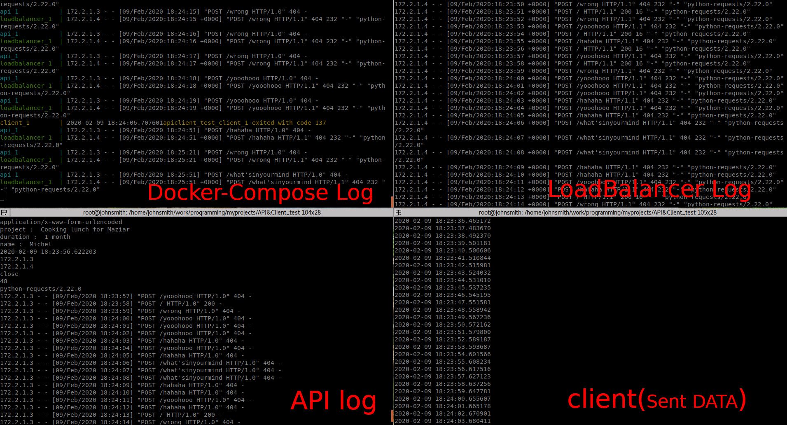

# API - Client to test your tools on an docker base platform

New changes:
**Integrated with OpenTrace technology**
 
You can commit the docker images and use in your kubernetes. 

# Goal
The goal of this project is to make a simple, simulated space working like a cloud with (at least)one API node which gets every request and do something, (at least) one client which sends requests to a loadblancer and a loadbalancer which handles the requests and pass them to API node.
after all we are going to monitor the loadbalancer (Or any part of the project we want) with NetData.
Also you can do your tests on this space easily.

**This project has 2 parts:**

## API:

This API gets all requests sent to it and write down on a log file. it gets the body of request and it's headers as well.
You can scale up This node just by editing bash script and using docker-compose commands according to [this help](https://docs.docker.com/compose/reference/scale/)

-- also is tracing in jaeger (OpenTracing)
## Client:
Constantly sends requests to the api with different bodies and different URLs in every x seconds (mentioned in code) 
since the urls are different, some of them are going to fail and by that we can have our nginx error log for furthur actions.

## How to Run:
run the bash script in the project(**Fire.sh**) or just type `docker-compose up`

__Take care of the ports we are using in the project and see if you're not using them by another projects or APPs.__

## OpenTracing:

To get benifit of opentracing you should know it's just a simple config and there is no span defined in the project and requests are tracing generally.

**To see Jeager dashboard:**

Open `localhost:16686`

if you had any question, we can be in touch via:

[maziar.sh110@gmail.com](mailto:maziar.sh110@gmail.com)

[Linkedin](https://www.linkedin.com/in/maziar-shahsavanpour-a4210088/)

[Whatsapp](https://api.whatsapp.com/send?phone=+989156262067)
